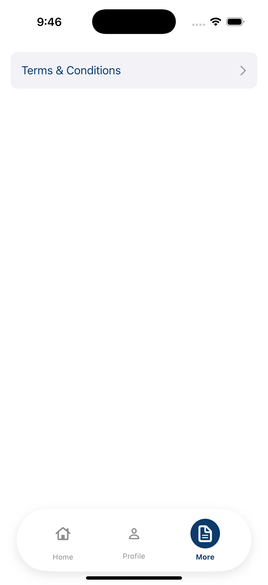
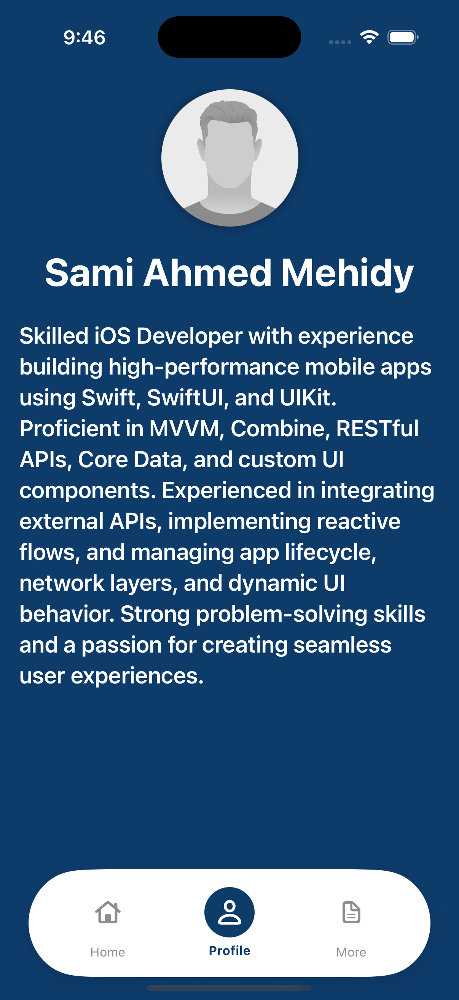
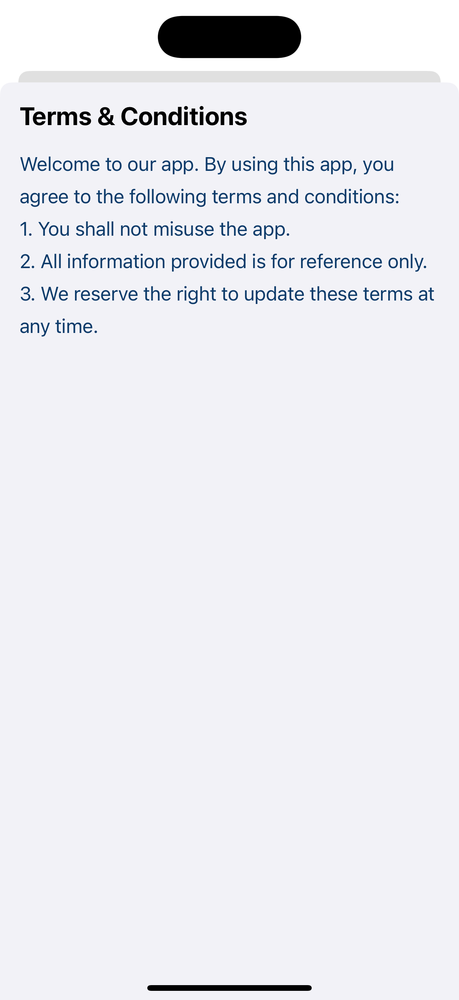
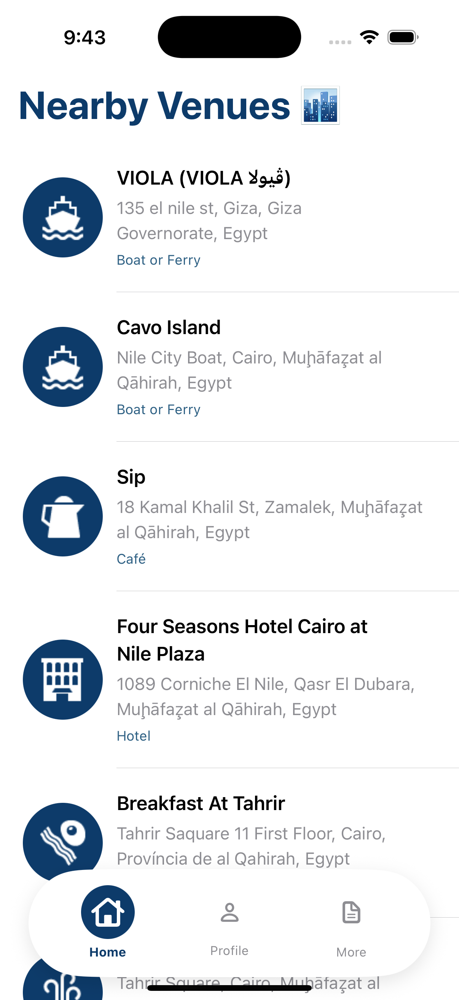

# CF_Task_iOS_SamiAhmed

<!-- Stacked Screenshots -->
<p align="center">
  
  
  
  
</p>

## 📱 Overview
An iOS app built with **SwiftUI** following **MVVM** and **Clean Architecture**.  
Features include getting current location coordinates, finding nearby venues, showing user profiles, and displaying terms & conditions.

## ⚙️ Features
- Get current location coordinates
- Find nearby venues
- Show user profile
- Display terms & conditions

## 🛠️ Technologies
- **Swift** + SwiftUI
- **Architecture:** MVVM + Clean Architecture
- **Concurrency:** Async/Await
- **Package Manager:** Swift Package Manager (SPM)
- **Dependencies:** Lottie, Custom Network Layer (as Swift Package)

## 🚀 How to Run
1. Clone the repo:
```bash
git clone https://github.com/Samiiahmedd/CF_Task_iOS_SamiAhmed.git
